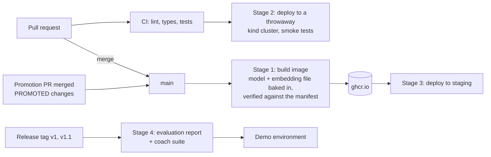

# Smart Financial Coach — Delivery Plan: CD and the Web App

Oct 2, 2026 · Owner: @Sidd · Status: **Proposed** · Branch: `docs/delivery-plan`

## Summary

This plan answers two questions: where continuous deployment (CD) slots into the build, and when web app development starts.

- **Start the product track now, in parallel with the model work.** Build a thin, deployed "walking skeleton": tool server, then a minimal web app. Don't wait for step 8 of the Technical Design's build order. The models are already behind stable contracts, and the risks that remain are integration risks that more model work won't reduce.
- **CD lands in four stages, each useful on its own:**
  1. **Package:** one container image with the promoted model and its embedding file baked in and verified.
  2. **Ephemeral deploy in CI:** every relevant PR deploys to a throwaway Kubernetes cluster and runs smoke tests.
  3. **Staging:** merging to `main` deploys to a hosted staging environment, and merging a promotion is itself a deployment.
  4. **Release gates:** a tagged release regenerates the evaluation report and runs the coach suite before it reaches the demo environment.
- **Stages 1 and 2 need no cloud account.** Stage 3 needs a hosting decision from the owner.
- **Decisions needed** are collected in [Decisions and open questions](#decisions-and-open-questions): the two tracks, the deploy target, the web framework, the tool server's transport, and where staging is hosted.

## Where things stand (Oct 2, 2026)

| Area | State |
| --- | --- |
| Synthetic data and labels (FR-1, FR-2) | Done |
| Categorization (FR-3) | Done. bge-base is promoted; `sfc-model predict` writes predictions files; model files live in GitHub Releases |
| New merchants (FR-4) | Feasibility in progress |
| Review and corrections (FR-5, FR-6) | Design in review (#15); it already specifies tools and their JSON shapes for the web app and coach |
| Unusual spending (FR-7, FR-8), goals (FR-10–12) | Not started |
| Tool server, coach, web app | Empty package stubs (`access/`, `experience/`) |
| CI | Lint, format, types and tests on every push; a slow job on model and data changes; `main` requires a PR and a green `check` |
| Delivery | None. Nothing runs outside a developer's machine |

Serving also has three interim limits, recorded in FR-3, that CD exists to remove:

- the promoted model file is downloaded from a GitHub Release on first use;
- the embedding model file (about 130 MB for bge-base) is downloaded by `fastembed` on first use;
- so the serving folder must be writable, and a cold start depends on two external hosts.

## Why not wait for step 8

The Technical Design builds bottom-up: models, then the tool server (step 6), the coach (7) and the web app (8). That order follows the dependencies, but it no longer follows the risk.

- **The biggest remaining risks are integration risks:**
  - data isolation end to end (NFR-2, release-blocking);
  - the dashboard under 2 s (NFR-5);
  - tool contracts consumed by real clients;
  - a model with downloaded files running in a deployment.

  More model work reduces none of them.
- **The contracts already exist.** FR-3's batch contract, the Technical Design's tool table and #15's review tools are enough to build a UI against while the models mature. Services that aren't built yet return a typed "not available yet", never a number (FR-14, NFR-1).
- **FR-5 and FR-6 are mostly UI.** Their thresholds and review burden only mean something once a user can see the review queue.
- **CD needs something to deploy.** A skeleton gives it one now, and every later feature then ships through the same pipeline.
- **The project shows how the system is built.** A deployed thin slice early, with features filling it in, is the strongest evidence of that.

## Two tracks

The model track continues unchanged. A product track starts alongside it, and the two meet where a model's promotion lights up a part of the UI.

| Model track | Product track |
| --- | --- |
| FR-4 feasibility and design | Decisions: web framework, tool transport, hosting target |
| FR-5/FR-6 milestones 1–2 (contract, review policy, feedback store) | Tool server skeleton; CD stages 1–2 |
| FR-5/FR-6 milestones 3–6 (tools, simulator, retraining) | Web app skeleton; review queue and corrections UI |
| FR-7, FR-8 (unusual charges, spikes) | Flags panel and alerts |
| FR-10–12 (goals) | Goals panel |
| Coach evaluation suite | Coach chat in the web app; release gates (CD stage 4) |

**Sync rule:** a UI panel ships with a "not available yet" state first. It switches to real numbers in the PR that promotes the model behind it, so neither track blocks the other.

## Where CD slots in

| Stage | What it adds | Trigger | Needs | Removes |
| --- | --- | --- | --- | --- |
| 1. Package | One image with every entry point; the promoted model and its embedding file baked in and verified | Merge to `main` | Nothing new (GitHub Container Registry) | All three interim limits |
| 2. Ephemeral deploy | A `kind` cluster in GitHub Actions; deploy, seed a small dataset, run smoke tests | PRs touching `src/`, `deploy/`, the Dockerfile or the lock file | Nothing new | "Works on my machine" |
| 3. Staging | A long-lived environment updated from `main`; promotion as a deployment | Merge to `main` | A hosted cluster (owner decision) | Manual deploys |
| 4. Release gates | Evaluation report regenerated (FR-20, NFR-8); coach suite run (grounding, safety, isolation) before the demo is updated | Release tag | An LLM key in CI; LLM cost per release | Releasing without the PRD's release-blocking checks |

### Stage 1: package

- **One image, several entry points:** the web app, the tool server, the ingestion worker and the batch jobs share the code and the lock file, so they always run the same version. They are deployed as separate workloads.
- **Build steps:**
  - `uv sync --locked --no-default-groups`, so MLflow and dev tools stay out of the serving image (FR-3's `train` group);
  - for each service's `PROMOTED` version, download the model file from its release and **fail the build** unless it matches the committed manifest's checksum;
  - download the embedding model file and fail unless it matches the checksum the model's manifest records;
  - run as a non-root user on a read-only root filesystem.
- **Tags:** the git commit, with the promoted model versions as image labels, so the running image says which models it serves.
- **Effect:** no host is contacted at cold start, no folder needs to be writable, and the checksum trust anchor moves from first use to build time. This is the "continuous deployment bakes the promoted model into the serving image" path that the Technical Design's infrastructure table already names.

### Stage 2: ephemeral deploy in CI

- A `kind` cluster inside the GitHub Actions job: free for a public repository, and the same manifests as staging.
- A Job generates `small.yaml` and checks its content hash, so the data is reproducible (NFR-8).
- **Smoke tests:**
  - every workload becomes ready;
  - `load_service` loads the baked model with no network access;
  - a `predict` run on the small dataset passes its contract;
  - the tool server returns user A's data to user A and nothing to user B (NFR-2, adversarial from the first deploy);
  - dashboard p95 under 2 s on the small dataset (NFR-5);
  - with the LLM disabled, the dashboard still works and chat shows a clear message (NFR-6).
- Path-filtered like `slow.yml`, so docs-only PRs skip it.

### Stage 3: staging, and promotion as a deployment

- Merging to `main` builds the image and rolls it out to staging.
- **A promotion is a deployment.** Merging a promotion PR changes `PROMOTED`, so the next image carries the new model. The ingestion worker sees a new `model_version` and recomputes the predictions file in its next batch (FR-3 option C-b). Overrides from FR-6 survive, because they live in their own store.
- **Rollback** is redeploying the previous image, which is the same as promoting the previous version (FR-3).
- **Retraining from feedback (FR-5/FR-6)** produces candidate runs on a schedule, but a promotion still goes through a reviewed PR. CD deploys only what was merged.

### Stage 4: release gates

The PRD makes grounding, safety and isolation release-blocking. Stage 4 runs them where they belong, on release tags (v1, v1.1), not on every PR:

- regenerate the evaluation report and check it reproduces (FR-20, NFR-8);
- run the coach suite: grounding ≥ 95%, safety 100%, cross-user requests refused 100%;
- only then update the demo environment.

The coach suite calls the LLM, so it costs money per run. That's why it runs per release, as the `llm` test marker already anticipates.

## What CD deploys

| Workload | Kind | Notes |
| --- | --- | --- |
| Web app | Deployment | Dashboard, chat and user selection. Talks only to the tool server |
| Tool server | Deployment | Tools over HTTP. Binds the session user and scopes every query (Technical Design, security) |
| Ingestion worker | Deployment or CronJob | Categorizes new transactions in batches across users. Applies per-user overrides after inference once FR-6 lands |
| Batch jobs | CronJobs | Anomaly flags and forecasts (nightly precompute); retraining candidates later |
| Data | Volume | SQLite in stages 2–3, Postgres in v2 (Technical Design) |

**Constraints this topology makes visible:**

- **SQLite allows one writer.** With SQLite on a single-node volume, one workload owns writes (the tool server for FR-6's feedback store, the ingestion worker for predictions), and replicas stay at one. That's fine for staging and a demo. Moving FR-5/FR-6's feedback store to Postgres may need to happen before v2, and is listed as an open question.
- **Sizing comes from FR-3's measurements:** about 12,000 transactions per second per process and about 2 GB peak at 20k-row batches for categorization. The ingestion worker's requests and limits start there.
- **Secrets** (the LLM key) come from GitHub environment secrets into Kubernetes secrets, never into the image (NFR-3).
- **A public demo needs a gate,** even on synthetic data. Chat spends LLM money, so the demo sits behind basic access control with a rate limit (NFR-9).

## When the web app starts

**Now, as a skeleton**, right after the tool server's first slice. In order:

1. **Decisions (now):** the web framework, the tool server's transport and the hosting target. The LLM provider can wait until the coach.
2. **Tool server skeleton (Technical Design step 6, early):**
   - session identity and data-access scoping;
   - `get_transactions` and `get_spending_summary` on real categories, and `list_goals` on generated goals;
   - anomaly and forecast tools return a typed "not available yet" status;
   - adversarial isolation tests from the start.

   Ships with CD stages 1–2.
3. **Web app skeleton (step 8, early):**
   - user selection;
   - spending by category, the monthly trend, and a transaction list with category and confidence (FR-17, partly);
   - flags and goals panels in their "not available yet" state.

   Dashboard latency is measured in stage 2's smoke tests from the first version.
4. **Staging** (CD stage 3), once hosting is decided.
5. **Coach (step 7):** chat in the web app once the LLM provider is decided, with the coach suite added to stage 4.
6. **Feature UIs as models land:** the review queue and corrections (after FR-5/FR-6 milestone 3, its tools), the flags panel (FR-7, FR-8), the goals panel (FR-10–12).

**Web framework (recommendation).** Server-rendered Python (FastAPI with templates and htmx):

- one language, one image, one test setup;
- the session and identity binding stay on the server, which is where the isolation design puts them;
- the review and correction flows are forms and partial updates, which htmx handles well.

The Technical Design's v2 path ("hosted front end + API") stays open: the tool server's HTTP API is what a separate front end would call later.

**Tool transport (recommendation).** HTTP for the web app and any hosted deployment, plus stdio for local third-party assistants (FR-19). #15 already assumes the web app calls tools over HTTP.

## Options considered

### A. When web app development starts

| Option | Pros | Cons |
| --- | --- | --- |
| (a) Build order step 8, as planned | Builds on finished models | Integration and isolation risk found last; no CD target until late |
| **(b) Walking skeleton now; panels fill in as models land (recommended)** | Retires integration risk early; gives CD a target; FR-5/FR-6 get a real UI | Two tracks to keep in sync (the sync rule handles it) |
| (c) Full UI now | Fastest visible progress | Built against tools that FR-7, FR-8 and FR-10–12 haven't designed yet; rework |

### B. Deploy target

| Option | Pros | Cons |
| --- | --- | --- |
| (a) Docker Compose on one VM | Simplest | A different shape from the batching-on-a-cluster decision; no CronJobs; harder to grow |
| **(b) Kubernetes; `kind` in CI, a hosted cluster for staging (recommended)** | Matches the owner's cross-user batching on a cluster; the same manifests from CI to staging; CronJobs and Jobs for batch work | More moving parts; a hosted cluster costs money |
| (c) A platform as a service | Little operations work | Worker, CronJobs and volumes fit less naturally; vendor-specific |

### C. How the model reaches serving

| Option | Pros | Cons |
| --- | --- | --- |
| (a) First-use download (today) | Already built | GitHub and Hugging Face at cold start; a writable folder |
| **(b) Baked into the image at build time, verified (recommended; Technical Design)** | No runtime dependencies; verification moves to build time; an image is a complete, rollback-able unit | Larger images (about 150 MB for the models); a new image per promotion |
| (c) A separate artifact pulled by an init container | Smaller images | The runtime dependency comes back, one step earlier |

### D. Hosted staging and demo (owner decision)

| Option | Pros | Cons |
| --- | --- | --- |
| (a) None: `kind` in CI only | No cost | Nothing to show between releases; no long-running ingestion |
| (b) One small VM running k3s | Low fixed cost; real Kubernetes | Self-managed; one node |
| (c) Managed Kubernetes (e.g. GKE Autopilot, EKS) | Closest to production; scales for the batching decision | Highest cost; a cloud account and its access to manage |

## Milestones

One PR per milestone, interleaved with the model track.

1. **D1, image:** the Dockerfile; build-time download and verification of model and embedding files; build and push to ghcr.io on merge to `main`; a test that the image serves with no network access and a read-only filesystem.
2. **P1, tool server skeleton**, with isolation tests.
3. **D2, manifests and ephemeral deploy:** Kubernetes manifests (kustomize, one base with an overlay per environment); `kind` deploy and smoke tests in CI.
4. **P2, web app skeleton**, measured by D2's smoke tests.
5. **D3, staging**, once hosting is decided, with promotion as a deployment.
6. **P3, coach**, once the LLM provider is decided.
7. **D4, release gates** on tags.

## Decisions and open questions

**Decisions for review**

- [x] Two tracks: the product track starts now, as a walking skeleton (owner, Oct 2, 2026; the web app started for the Oct 6 demo, Web App UI).
- [ ] CD in four stages; models (and their embedding file) baked into the image and verified at build time.
- [ ] Kubernetes as the deploy target, with `kind` in CI.
- [x] Web framework: server-rendered Python (FastAPI, templates, htmx) (owner, Oct 2, 2026).
- [x] Tool server transport: MCP over Streamable HTTP, served at `/mcp` by the web app for the demo, with bearer tokens for identity (owner, Oct 3, 2026; Web App UI, decision 8). stdio isn't built: desktop assistants connect over HTTP.
- [ ] Hosted staging and demo target: option D (owner). Still open for staging. The Oct 6, 2026 demo runs on Azure Container Apps as a short-lived shortcut outside option D, torn down after the demo (owner, Oct 2, 2026; Web App UI, "Demo build").

**Open questions**

- [x] LLM provider: Anthropic (owner, Oct 2, 2026; Technical Design).
- [x] Access control and an LLM budget for a public demo (NFR-9): demo accounts behind one shared password, rate limits on sign-in and chat, and a spending cap on the API key (owner, Oct 2, 2026; Web App UI, decision 1).
- [ ] When SQLite gives way to Postgres. The Technical Design says v2, but FR-5/FR-6's feedback store has writes from several entry points and may pull it earlier.
- [ ] Whether staging also hosts the shared MLflow server (FR-3 open question).

**Technical Design updates (after approval)**

- [ ] Build order: two tracks, with the tool server and web app skeleton started early.
- [ ] Infrastructure: a CD row (image, `kind` in CI, staging, release gates); model artifacts baked into the image in v1, no longer only in v2.
- [ ] Open questions: tool transport and web framework settled.
