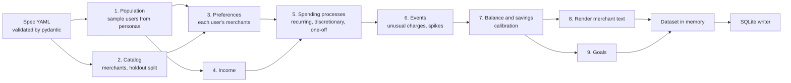

# FR-1 Synthetic Data Generator — Feature Design

Sep 30, 2026 · @Sidd · Status: **Implemented** (see [Implementation notes](#implementation-notes)) · Branch: `feature/fr-1-synthetic-data`

## Summary

This feature builds one generic, parameter-driven data generator that every v1 capability trains and is evaluated on.

- **Requirement:** FR-1 (P0): *"v1 operates on synthetic data for many users over at least two years, reflecting real-world variability: messy merchant text, varied income patterns, seasonality."*
- **Approach:** a pure function `generate(spec) → dataset`. A spec file (YAML) holds every parameter: calendar, populations, personas, merchant catalog, spending processes, events, rendering and goals. The same code serves every use case; use cases differ only by spec file.
- **Scope boundary:** the generator only *generates*. It records the ground truth of everything it creates. Training-time perturbations such as label noise, row drops and augmentation belong to the model training pipeline, which applies them to data it has loaded.
- **Output:** a single local SQLite file per dataset (stdlib `sqlite3`, no server), replacing the earlier Parquet proposal.
- **Decisions needed from review** are collected in [Decisions and open questions](#decisions-and-open-questions).

## Context

Everything downstream depends on this data being realistic enough to be hard, and exact enough to measure against.

| Downstream consumer | What it needs from the data |
| --- | --- |
| Categorization (FR-3, FR-4) | Messy merchant text with true categories; a set of merchants that never appear in training users' data |
| Unusual transactions (FR-7) | A stable per-user "normal", plus labeled unusual charges |
| Spending spikes (FR-8) | Weekly / monthly category totals with realistic seasonality, plus labeled spike periods |
| Goal forecasting (FR-11, FR-12) | ≥ 24 months of monthly net savings per user; goals whose outcome is known |
| Coach and personalization (scenario 4) | Users of the same persona who still differ, so the same question gets different answers |
| Evaluation harness (FR-20, NFR-8) | Identical regeneration from a spec; train and test users from separate seeds |

## Goals and non-goals

The generator's job is realism the models must work for, under full parameter control.

**Goals**

1. **Generic:** all behavior comes from the spec. New personas, categories, merchants, event types or date ranges need a spec change, not a code change.
2. Generate many users across the PRD personas, each with ≥ 24 months of history (default 36), with users within a persona measurably different.
3. Produce merchant text as messy as real bank feeds, with the level of mess set by a parameter (it can be turned off for debugging).
4. Model three income patterns (single salary, dual income, irregular freelance) and seasonality at both category and income level.
5. Generate labeled events (normal one-offs, unusual charges, spending spikes) from parameters, so FR-2's ground truth comes from the same run.
6. Write one SQLite file with model-visible tables and clearly separated `truth_*` tables, reproducible from the spec.
7. Usable as a library (in-memory result for tests and experiments) and as a CLI.

**Non-goals (v1)**

- **Training-time perturbations:** label noise, dropping or corrupting rows, and augmentation are done by the training pipeline on loaded data. This covers the Technical Design control "label noise injected into the data".
- Multiple accounts per user, credit-card payments, or transfers between own accounts: one combined account per user.
- Statistical fidelity to a specific real population. Parameters are calibrated to plausible public ranges.

### What counts as generation versus perturbation

Applying the boundary above:

| Stays in the generator (part of the world being simulated) | Moves to training (applied to loaded data) |
| --- | --- |
| Messy merchant text: it is what real bank feeds look like, and FR-1 requires it | Flipping a share of training labels (label noise) |
| Ambiguous merchants whose true category varies per transaction | Dropping, duplicating or corrupting rows |
| Irregular income, seasonality, lumpy one-off purchases | Text augmentation for the categorizer |
| Unusual charges and spending spikes, with labels | Re-sampling or class balancing |

Anomalies stay in the generator for a practical reason: an injected charge has to change the user's balance, savings and goal progress. Only the generator can keep all of those consistent.

## What it will look like

The feature is a Python package, committed spec files, and one command that writes a SQLite file.

### Usage

```sh
uv run sfc-data generate --spec configs/data/default.yaml --out data/synthetic/default.sqlite
uv run sfc-data hash data/synthetic/default.sqlite     # content hash for determinism checks
```

```python
from smart_financial_coach.data.generator import generate, load_spec

dataset = generate(load_spec("configs/data/small.yaml"))  # in memory, pandas DataFrames
dataset.to_sqlite("data/synthetic/small.sqlite")
```

- Same spec → same content hash (checked in CI with `small.yaml`).
- Target runtime for the default spec: under 60 s on a laptop, CPU only.

### Spec files

Each use case is a spec. All of them share one schema, validated by pydantic on load.

| Spec | Purpose |
| --- | --- |
| `default.yaml` | Main dataset: 360 users (240 train, 120 test since FR-2), 36 months, realistic mess, anomaly and spike events on |
| `small.yaml` | 30 users, 24 months; tests and CI determinism |
| `clean.yaml` | Default with rendering distortion off and no events; debugging and sanity baselines |
| Experiment specs | Created as needed, e.g. a higher anomaly rate or more holdout merchants |

A spec's shape (abridged):

```yaml
calendar:
  start: 2023-10-01
  end: 2026-09-30
populations:                       # one seed per population; train and test never share
  - {name: train, split: train, seed: 1001, id_prefix: tr, users: {young_professional: 80, family_budgeter: 80, freelancer: 80}}
  - {name: test,  split: test,  seed: 2002, id_prefix: te, users: {young_professional: 40, family_budgeter: 40, freelancer: 40}}
personas: personas/                # one YAML per persona: parameter distributions
catalog:
  merchants: merchants.csv
  holdout: {share: 0.4, exclude_top_n_per_category: 3, test_user_bias: 0.45, seed: 8}  # FR-4; was 0.2, 1.25, 7
rendering:
  distortion: realistic            # none | light | realistic | heavy
events:
  one_off:        {rate_scale: 1.0}   # one-offs are defined per persona; normal, never labeled anomalies
  unusual_charge: {rate_per_user_year: 1.5, kinds: [duplicate, amount_outlier, new_merchant_large]}
  spending_spike: {rate_per_user_year: 1.0, multiplier: [1.8, 3.0], granularity: [week, month]}
  refunds:        {share: 0.03, categories: [Shopping], lag_days: [3, 20]}
goals:
  per_user: [1, 2]
  outcome_mix: {on_track: 0.34, borderline: 0.33, off_track: 0.33}
  target_inside_history_share: 0.5
```

### Tables

All tables live in one SQLite file. Model-visible tables have plain names; ground truth lives in tables prefixed `truth_`, which the feature pipeline never reads.

**users**

| Column | Type | Notes |
| --- | --- | --- |
| user_id | TEXT PK | `u_<population>_<persona>_<index>`, e.g. `u_tr_yp_0042`. The persona code keeps IDs, and so seeds, stable when another persona's count changes |
| split | TEXT | `train` or `test` |
| persona | TEXT | e.g. `young_professional` |
| timezone | TEXT | IANA name from the user's home city, e.g. `America/Chicago` |
| monthly_income_estimate | REAL | Mean monthly inflow over the history, rounded to dollars |
| starting_balance | REAL | Set so the running balance never goes below zero |

**transactions** (model-visible)

| Column | Type | Notes |
| --- | --- | --- |
| transaction_id | TEXT PK | Hash of (user_id, process, counter within that process), so adding events never renumbers others |
| user_id | TEXT | Indexed with `ts` |
| ts | TEXT | ISO 8601 local time in the user's timezone, minute resolution |
| amount | REAL | Rounded to cents; negative = money out, positive = money in |
| currency | TEXT | `USD` for v1 |
| merchant_raw | TEXT | Messy bank-feed text, e.g. `SQ *BLUE BOTTLE COF #0412` |
| channel | TEXT | `card_present`, `online`, `ach`, `other`: values real feeds provide. No `recurring` value, which would leak the `is_recurring` label |

**goals** (model-visible)

| Column | Type | Notes |
| --- | --- | --- |
| goal_id | TEXT PK | |
| user_id | TEXT | |
| name | TEXT | e.g. "Vacation fund" |
| target_amount | REAL | |
| created_date | TEXT | Date the goal was set |
| target_date | TEXT | Inside the history for about half of goals, so their outcome is known |
| as_of_date | TEXT | Date `current_balance` is measured at: 3–12 months before `target_date` for goals that end inside the history, otherwise the end of the history |
| current_balance | REAL | Saved toward the goal as of `as_of_date` |

**truth_transactions** (eval only, one row per transaction)

| Column | Type | Notes |
| --- | --- | --- |
| transaction_id | TEXT PK | |
| category | TEXT | True category (FR-3) |
| merchant_id | TEXT | Canonical merchant (FR-4 unseen-merchant split) |
| process | TEXT | `income`, `recurring`, `discretionary`, `one_off`, `refund`, `unusual_charge` |
| is_recurring | INTEGER | 0 / 1 |
| anomaly_kind | TEXT, nullable | Set only for `unusual_charge` |
| related_transaction_id | TEXT, nullable | Added by FR-2. Duplicate: the original charge; refund: the purchase refunded |

**truth_periods** (eval only, spending spikes at period level)

| Column | Type | Notes |
| --- | --- | --- |
| user_id | TEXT | |
| granularity | TEXT | `week` or `month` |
| period_start | TEXT | |
| category | TEXT | |
| multiplier | REAL | Planted spend multiplier for that period |

FR-2 adds `spike_id` (now the primary key), `period_end`, expected and realized spend, and a `clear` / `weak` tier, plus a `truth_expected` table of expected monthly spend. See FR-2 Ground Truth Labels — Feature Design.

**truth_goals** (eval only)

| Column | Type | Notes |
| --- | --- | --- |
| goal_id | TEXT PK | |
| outcome_class | TEXT | Planned `on_track`, `borderline`, `off_track` |
| met | INTEGER, nullable | Realized 0 / 1 when `target_date` is inside the history |

**truth_merchants** (eval only) and **meta**

- `truth_merchants`: the catalog used for the run, with category, subtype, price median and spread (added by FR-2), `is_ambiguous` and `holdout` flags, and `holdout_eligible` (added by FR-3): whether the holdout rule may pick the merchant at all.
- `meta`: key/value rows for generator version, spec hash, seeds, the category list and (since FR-2) the label contract. No timestamps, so the content hash stays stable.

### Example rows

| user_id | ts | amount | merchant_raw | channel | *category (truth)* |
| --- | --- | --- | --- | --- | --- |
| u_tr_yp_0042 | 2025-08-01 05:12 | 2,310.44 | ACME CORP PAYROLL PPD ID: 9912 | ach | Income |
| u_tr_yp_0042 | 2025-08-01 00:05 | −1,850.00 | OAKWOOD PROPERTY MGMT WEB PMT | ach | Housing |
| u_tr_yp_0042 | 2025-08-02 08:14 | −6.45 | TST* COMMON GROUNDS DEN | card_present | Dining |
| u_tr_yp_0042 | 2025-08-02 23:41 | −18.72 | UBER *TRIP*PUW5J0E | online | Transportation |
| u_tr_yp_0042 | 2025-08-03 11:03 | −87.19 | TRADER JOE S #552 SAN FRANC | card_present | Groceries |
| u_tr_yp_0042 | 2025-08-05 03:00 | −15.49 | NETFLIX.COM | online | Subscriptions |
| u_tr_yp_0042 | 2025-08-09 14:27 | −64.00 | AMZN Mktp US*2K4LM0T91 | online | Shopping |

## Design

The generator is a pipeline of small stages. Each stage reads only the spec and its own seeded random generator and returns DataFrames; the writer is the only part that touches SQLite.



Events (stage 6) run before balances and goals (stages 7 and 9), so every labeled anomaly is reflected in the user's balance and goal progress.

### 1. Category taxonomy

The category list is part of the spec (default below), recorded in `meta`, and validated so every merchant and persona references a known category.

| # | Category | Examples |
| --- | --- | --- |
| 1 | Housing | Rent, mortgage, HOA |
| 2 | Utilities | Electric, gas, water, internet, phone |
| 3 | Groceries | Supermarkets, warehouse clubs (grocery trips) |
| 4 | Dining | Restaurants, coffee, food delivery, bars |
| 5 | Transportation | Rideshare, transit, fuel, parking |
| 6 | Shopping | General retail, online marketplaces, electronics, clothing |
| 7 | Entertainment | Movies, concerts, games, events |
| 8 | Subscriptions | Streaming, software, memberships |
| 9 | Health & Fitness | Pharmacy, doctor copays, gym |
| 10 | Travel | Airlines, hotels, short-term rentals |
| 11 | Childcare & Education | Daycare, tuition, school fees, camps |
| 12 | Insurance & Fees | Auto / renters insurance, bank fees, estimated taxes |
| — | Income | Payroll, client payments. Refunds keep their spending category |

### 2. Merchant catalog

A committed CSV of canonical merchants (324 rows) is the source of all merchant names.

- **Columns:** `merchant_id`, `canonical_name`, `category`, `subtype` (e.g. coffee, rent, payroll), `scope` (national, local, online), `processor` (e.g. square, toast, paypal, stripe, zelle, none), `channel_mix`, `price_median`, `price_sigma`, `peak_hour`, `popularity`, `descriptor` (the bank's own text where it differs, e.g. `AMZN Mktp US*`), `ambiguous_categories`. Persona streams select merchants by category and subtype.
- **Prices:** log-normal per merchant (coffee shop ≈ $4–9, supermarket ≈ $30–180).
- **Ambiguous merchants:** warehouse clubs and marketplaces draw their true category per transaction, so the same text can legitimately be Groceries or Shopping.
- **Holdout (FR-4):** a seeded share of merchants per category is marked holdout and used **only** by test users. The most common merchants per category, and the most common merchant of each subtype, are never held out, so training data always includes the big chains and every subtype. Test users weight holdout merchants by `test_user_bias`, tuned to 1.25 so about 22% of their spending transactions are at holdout merchants.
- **Names:** well-known chains plus fictional local businesses for the long tail. The long tail may be drafted once with an LLM, reviewed by hand and committed.

### 3. Personas and per-user variation

A persona is a YAML file of parameter *distributions*, not a fixed user, so two users of the same persona differ. Adding a persona means adding a file.

| Parameter | Young professional | Family budgeter | Freelancer |
| --- | --- | --- | --- |
| Income pattern | One salary, biweekly | Two salaries, different schedules | Irregular client payments |
| Net monthly income (sampled) | $4.5k–8k | $8k–14k combined | $3k–12k, high month-to-month variance |
| Heavy categories | Dining, Transportation, Travel | Groceries, Childcare & Education, Utilities | Shopping (equipment), Subscriptions (software), Insurance & Fees (quarterly taxes) |
| Seasonality | Travel around the planned trip; December dining | School year (childcare Sep–May, camps in summer), August back-to-school, Nov–Dec holidays | Slow January, strong Q4 income; quarterly estimated taxes |
| Typical goal | Vacation fund | Emergency fund / college fund | Tax reserve / income buffer |

Each user samples: income level, savings-rate target, per-category rate multipliers, a Zipf-weighted set of favorite merchants per category, a home city (and timezone), and weekday/weekend habits.

### 4. Income

| Pattern | Model |
| --- | --- |
| Salaried | Fixed net pay on a biweekly Friday schedule; annual raise of 0–5% in a sampled month; optional annual bonus |
| Dual income | Two independent salary streams, e.g. biweekly and semimonthly (15th and last business day) |
| Freelance | 0–6 client payments per month from a small, sticky set of clients; log-normal amounts; monthly volume follows the persona's income seasonality plus one or two random slow months per year |

Pay dates on weekends or US bank holidays move to the previous business day.

### 5. Spending processes

Spending is the sum of three processes per user and category, each scaled by a seasonal multiplier from the persona.

1. **Recurring** (rent, utilities, subscriptions, insurance, childcare): fixed day of month ± 0–2 days; fixed or slowly drifting amounts. Utilities follow a heating/cooling curve. Subscriptions occasionally change price, start or stop.
2. **Discretionary** (dining, groceries, rideshare, shopping, entertainment): weekly purchase counts are Poisson with rate = user base rate × day-of-week weight × monthly seasonal multiplier. Each purchase picks a favorite merchant and draws from that merchant's price distribution. Time of day follows the category.
3. **One-offs** (electronics, travel, car repairs, medical bills): rare events with heavy-tailed amounts. These are **normal** behavior, not anomalies; they are what makes anomaly detection non-trivial.

**Income coupling:** freelancers' discretionary rates scale with trailing two-month income; salaried users get a small payday bump.

**Refunds:** a spec-set share of Shopping purchases get a matching positive refund 3–20 days later, reusing the original transaction's rendered text.

### 6. Events

Events are generic, parameterized processes that write both transactions and truth rows. FR-2 is delivered by configuring them, not by a separate injector.

| Event | Effect | Truth |
| --- | --- | --- |
| `unusual_charge` | Adds one transaction unlike the user's normal: duplicate charge, amount far outside the merchant's usual range, or a large charge at a never-seen merchant | `truth_transactions.anomaly_kind` |
| `spending_spike` | Multiplies one category's discretionary rate for one week or month. Since FR-2 the extra purchases are drawn as a separate process at rate × (m − 1) | `truth_periods` row |

Events never overlap a seasonal peak in the same category and period, so a planted spike is distinguishable from seasonality by construction.

### 7. Balance and savings calibration

- Each user's long-run savings rate is brought near their sampled target by scaling **discretionary purchase rates** and regenerating. Amounts are never rescaled, so prices stay within each merchant's range.
- `starting_balance` is the larger of a sampled cushion and the amount needed to keep the running balance at or above zero.

### 8. Rendering messy merchant text

Canonical names become bank-feed strings by composing distortions per transaction. `rendering.distortion` sets the probabilities; `none` outputs canonical names.

| Distortion | Example |
| --- | --- |
| Processor prefix | `SQ *`, `TST* `, `PAYPAL *`, `SP * ` |
| Store / terminal number | `#4321`, `STORE 04321` |
| Location suffix | `SAN FRANCISCO CA`, `SAN FRANC` (truncated) |
| Truncation | Bank-style limit of ~22–32 characters |
| Casing and punctuation | Upper-casing, dropped apostrophes (`TRADER JOE S`) |
| Channel prefixes | `POS DEBIT`, `ACH DEBIT` |
| Reference codes | `AMZN Mktp US*2K4LM0T91`, `PPD ID: 9912` |
| Typos / spacing | Doubled spaces, occasional character drop |

Each merchant has a few stable "house styles", so the same shop looks similar most of the time but not always.

### 9. Goals

Goals are generated after balances, so their outcomes are known.

- Each user gets goals from their persona's goal types, with a created date inside the history.
- About half (spec-set) have a target date **inside** the history, so `truth_goals.met` is realized and the Brier score for P(goal met) can be computed by backtest. The rest have target dates after the history, as a live product would.
- `as_of_date` is each goal's **backtest origin**, and `current_balance` is reported as of that date. For goals that end inside the history, the origin is 3–12 months (spec-set) before the target, so the goals row itself doesn't reveal the outcome. Reporting the balance at the target date would let a model read `met` as `current_balance >= target_amount`.
- The `transactions` table still covers the whole history, including the months between `as_of_date` and `target_date`, so replaying net savings from it recovers `met` for nearly every goal. **Consumers must only use transactions with `ts <= as_of_date` for goal examples.** The evaluation harness enforces this when it builds splits; it is recorded as an evaluation control in the Technical Design.
- Targets are set relative to the user's own savings so outcomes split roughly evenly across on track, borderline and off track.
- **Known limitation:** goal savings are notional. They are a share of each month's net savings, floored at zero, and no transfer transactions record them. So `current_balance` can't be reconciled with the ledger, and the floor can put it above the user's actual cumulative savings. This is acceptable for v1 forecasting evaluation; modelling transfers to a savings account would fix it.

### 10. Reproducibility

- Each user's random generator is `SeedSequence(population_seed, spawn_key=(crc32(user_id),))`, with one child per stage. A user's data depends only on the population seed and their own ID, so changing another persona's user count leaves them unchanged, and users can be generated in parallel.
- The holdout split uses its own catalog seed.
- The calendar comes from the spec, never from today's date.
- **Determinism check:** SQLite file bytes can vary with page layout, so `sfc-data hash` computes a SHA-256 over every table's rows in primary-key order, plus `meta`. CI compares this hash across two runs of `small.yaml`.

### 11. Module layout

```
src/smart_financial_coach/data/generator/
  spec.py          pydantic spec and persona models; YAML loading with `extends`
  taxonomy.py      default categories, channels, processes, cities
  timeline.py      calendar, business days, US federal holidays
  catalog.py       merchant catalog, holdout split, per-merchant sampling
  population.py    stages 1–3: users, seeds and preferences
  ledger.py        per-user transaction accumulator and stable transaction IDs
  income.py        stage 4
  spending.py      stage 5
  events.py        stage 6
  calibration.py   stage 7, plus starting balance
  rendering.py     stage 8
  goals.py         stage 9
  pipeline.py      `generate(spec) -> Dataset`
  dataset.py       table schemas, in-memory Dataset and content hash
  sqlite_io.py     SQLite write (atomic) and read
  validate.py      data quality checks
  cli.py           `sfc-data generate | validate | hash`
configs/data/
  default.yaml  small.yaml  clean.yaml
  personas/*.yaml
  merchants.csv
```

New dependencies: `pyyaml` (plus `types-PyYAML` for strict mypy) and `holidays` for US federal (bank) holidays. `sqlite3` is in the standard library. `sfc-data` is registered under `[project.scripts]`.

## Options considered

Each choice below lists the realistic alternatives and a recommendation, for review.

### A. How to generate the data

| Option | Pros | Cons |
| --- | --- | --- |
| **(a) Spec-driven stochastic simulation (recommended)** | Full control; exact ground truth; cheap; reproducible; one code path for every use case | Realism depends on our parameters |
| (b) Resample a public transactions dataset | Real-world distributions | Rarely has messy merchant text, categories and multi-year per-user history together; no controllable ground truth |
| (c) Ask an LLM to generate histories | Realistic-looking text | Not reproducible, costly at ~1M rows, numerically inconsistent, untrustworthy labels |
| (d) Generic libraries (SDV, Faker) | Quick setup | SDV needs a real dataset to learn from; Faker gives names, not financial behavior |

### B. Time model

| Option | Pros | Cons |
| --- | --- | --- |
| (a) Day-by-day agent simulation | Natural place for behavioral rules | Slow in Python; harder to test each process alone |
| **(b) Independent processes per category, vectorized with numpy (recommended)** | Fast; each process testable alone | Cross-process effects (income coupling, events) added explicitly |

### C. Output store

| Option | Pros | Cons |
| --- | --- | --- |
| **(a) One SQLite file per dataset (recommended)** | Standard library; one file to pass around; queryable with SQL from tools and the coach; easy joins between truth and visible tables | File bytes not deterministic (solved by a content hash); slower than columnar formats for large scans (fine at ~1M rows) |
| (b) Parquet files | Fast columnar reads; byte-reproducible | Several files; no SQL without extra tooling |
| (c) DuckDB file | Fast SQL analytics | Extra dependency; less universal than SQLite |

### D. Where ground truth lives

| Option | Pros | Cons |
| --- | --- | --- |
| (a) Label columns inside `transactions` | One table | Easy to leak labels into features |
| **(b) `truth_*` tables in the same SQLite file (recommended)** | One file; leakage avoided by naming and by the feature pipeline's data-access layer, which only reads model-visible tables | Relies on that convention |
| (c) Separate `truth.sqlite` file | Leakage structurally impossible | Two files to keep together; `ATTACH` needed for eval joins |

### E. Amount representation

| Option | Pros | Cons |
| --- | --- | --- |
| **(a) REAL, rounded to cents (recommended)** | Natural for pandas, numpy and models | Float rounding in aggregates; mitigated by rounding at write |
| (b) INTEGER cents | Exact arithmetic | Conversions everywhere |

Sign convention: negative = outflow, positive = inflow.

### F. Spec format

| Option | Pros | Cons |
| --- | --- | --- |
| **(a) YAML validated by pydantic (recommended)** | Readable; comments; clear validation errors | Adds `pyyaml` |
| (b) TOML (stdlib) | No new dependency | Awkward for nested per-category, per-month tables |
| (c) Python only | Type-checked | Parameters buried in code |

### G. Train / test separation

| Option | Pros | Cons |
| --- | --- | --- |
| **(a) Two populations from two seeds (recommended)** | Matches the Technical Design control "separate seeds for training and test users"; holdout merchants appear only in test users | Test size fixed by spec |
| (b) One population, split users afterwards | Simpler | Seeds shared; unseen merchants need a separate mechanism |

**How this maps to the Technical Design's categorization split:** the "stratified 80/20 by transaction" split is taken within train users, which only use known merchants, and is the known-merchant test (target F1 ≥ 0.90). Test users' transactions at holdout merchants form the unseen-merchant test (target ≥ 0.80). The spec sets holdout share so that roughly 15–25% of test users' spending transactions come from holdout merchants.

### H. Dataset size

| Spec | Rows (approx.) | Notes |
| --- | --- | --- |
| `small.yaml` (30 users × 24 months) | ~60k | Tests and CI |
| **`default.yaml` (300 users × 36 months) (recommended)** | ~0.9M | Enough for per-persona statistics and the rolling backtest; about 27 s to generate and ~200 MB in SQLite. FR-2 raised it to 360 users: ~1.1M rows, ~39 s, ~260 MB |
| Large (3,000 users) | ~8–10M | Only if an experiment needs it; same code |

## Data quality checks

A `validate` step runs after generation and in CI, failing loudly rather than letting bad data reach models.

- **Schema:** every table and column present with the right type; no nulls where not allowed; primary keys unique; every transaction has exactly one truth row.
- **Coverage:** every user has ≥ 24 months and income in most months; every category appears for every persona that should have it.
- **Plausibility:** per-persona category shares, savings rates and transaction counts within spec ranges; no negative running balance.
- **Seasonality present:** e.g. family Childcare & Education spend in Sep–May well above June–Aug; Utilities follow the heating/cooling curve.
- **Mess present:** at `realistic` distortion, most `merchant_raw` values differ from canonical names and each merchant appears with several distinct strings.
- **Events present and consistent:** planted event counts match the spec rates within tolerance; the median observed lift across spike periods reflects the planted multipliers.
- **Split isolation:** holdout merchants never appear for train users; train and test user IDs don't overlap; with at least 30 test users, the share of test spending at holdout merchants is inside the spec's `test_share_range` (default 15–25%).
- **Goals:** `created_date <= as_of_date < target_date`, and known outcomes agree with their planned class.
- **Right spec:** validation refuses a dataset whose `meta.spec_hash` doesn't match the spec it's checked against.
- **Determinism:** two runs of `small.yaml` give the same content hash.

## Testing

Each stage is unit-tested on its own; the whole pipeline is tested on `small.yaml`.

- **Unit:** pay-date calendars (weekends, holidays); Poisson rates × seasonality give the expected monthly means; renderer respects length limits and prefixes; `none` distortion returns canonical names; spec validation errors are clear; seeds stay stable when another persona's user count changes.
- **Property-based (optional, `hypothesis`):** any valid spec yields data that passes the quality checks.
- **Integration:** `generate small.yaml` → `validate` passes → rerun gives the same hash → in-memory and SQLite round-trip give the same hash.
- **Performance smoke test:** default spec under 60 s, marked `slow`.

## Milestones

Built in thin vertical slices so something end-to-end exists early.

1. Spec models and YAML loading, taxonomy, calendar, seeded population → `users` table in SQLite.
2. Salaried income and recurring bills for one persona → first `transactions` and `truth_transactions`, clean names.
3. Discretionary spending with seasonality; all three personas and income patterns; calibration.
4. Merchant catalog with holdout and ambiguous merchants; messy rendering.
5. Events (one-offs, unusual charges, spikes), goals, `meta`, CLI and content hash.
6. Quality checks, determinism test in CI, and a notebook to eyeball realism (notebook not yet built).

## Decisions and open questions

The recommendations below were adopted when FR-1 was implemented.

**Decisions**

- [x] One generic spec-driven generator; use cases differ only by spec file.
- [x] Training-time perturbations (label noise, row corruption, augmentation) live in the training pipeline, not the generator.
- [x] Unusual charges and spending spikes are generator events (FR-2 is delivered as event specs on this branch, not as a separate injector).
- [x] Output is one SQLite file with `truth_*` tables (C-a, D-b); determinism checked by content hash.
- [x] REAL amounts, negative = outflow (E-a).
- [x] YAML specs validated by pydantic (F-a); adds `pyyaml`, `types-PyYAML`, `holidays`.
- [x] Default 300 users × 36 months; calendar 2023-10-01 → 2026-09-30.
- [x] The 12-category taxonomy above.

**Technical Design updates (applied)**

- [x] Transaction schema: labels move to `truth_*` tables; add `currency`, `channel`; add the `truth_periods` and `truth_goals` tables.
- [x] Data store: the generator writes SQLite directly; Parquet dropped.
- [x] Controls: "label noise injected into the data" becomes a training-pipeline step.
- [x] Categorization split: 80/20 within train users; unseen-merchant test from test users' holdout merchants.

**Open questions**

- [x] Is Income a class the categorizer predicts, or handled by a rule on sign and channel? (Affects FR-3's "~12 classes".) Settled in FR-3 (§4, option D-b): Income is a predicted 13th class, so text plus amount sign separate payroll from refunds, and it is excluded from the headline macro F1 (reported on its own line), so a near-perfect class doesn't inflate the average.
- [ ] Are real chain names acceptable in the merchant catalog, or should all merchants be fictional? The catalog currently mixes real chains with fictional local businesses; employers and freelance clients are all fictional.

## Implementation notes

What the implementation settled or changed relative to the draft above.

- **Default dataset:** 300 users, 896k transactions, 1,326 unusual charges, 990 spike periods, 199 goals with known outcomes; about 27 s to generate on a laptop; all quality checks pass.
- **User IDs** include the persona code (`u_tr_yp_0042`), so seeds stay stable when another persona's count changes.
- **The merchant table** is `truth_merchants`, following the `truth_*` naming that keeps eval-only data out of features.
- **One-offs** are defined per persona; the spec's `events.one_off.rate_scale` scales them all.
- **SQLite tables** are `WITHOUT ROWID`, which cut the default file from 228 MB to ~200 MB. Size is dominated by text IDs and merchant strings.
- **Spike check** uses the median lift across spikes, since a single week of Poisson purchases can miss its planted lift by chance.
- **Seasonality check** only tests profiles that vary by at least ×1.5; weaker profiles (e.g. ×1.3 winter pharmacy) are too noisy to test on the small spec.
- **Unusual charges** fall back to another kind when the drawn kind is impossible for a user (e.g. no merchants left that are new to them). Any that still can't be produced are counted in `meta.unusual_charges_dropped` (0 on the default spec).
- **Changed by FR-2:** spike extras are a separate `spike_extra` process (written as `discretionary`), calibration uses normal purchases only, the test population doubled to 40 per persona, and `validate` gained label and oracle checks. Discretionary seasonality is now checked against the exact expected counts in `truth_expected` (structural and Poisson goodness of fit), which holds at any volume; recurring bills keep the correlation check. FR-2 Ground Truth Labels — Feature Design has the details.
- **Not built yet:** parallel generation (users are independent, so it can be added without changing output) and the realism notebook.
- **Changed by FR-4 (Oct 2026):** the default holdout is 40% with seed 8 (`test_user_bias` 0.45 keeps test users' share at holdout merchants inside 15–25%): 115 holdout merchants instead of 58, and a test set FR-3 never scored. Train users see 176 spending merchants instead of 233. FR-3's dataset (share 0.2, seed 7, bias 1.25, schema 3, data hash `2f0e60a6`) is reproducible from the git tag `data/fr3-default`. FR-4 Unseen Merchant Categorization — Feature Design has the reasons.
- **Changed by FR-5/FR-6 (schema 4):** a last stage writes `truth_preferences(user_id, merchant_id, category)`: test users who see a merchant subtype in another category, per the spec's new `preferences:` section. It draws from its own seed, per user, after every other stage, so it changes no other row: the default dataset's other tables are identical to a 40%-holdout dataset generated without it. Train users never get preferences. Reading a file with another schema version fails with a message naming the tag to use.
