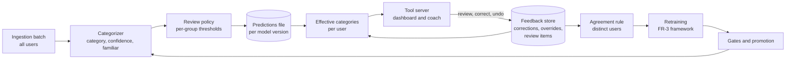

# FR-5 and FR-6 Review, Corrections and Retraining — Feature Design

Oct 2, 2026 · @Sidd · Status: **Proposed**; the data contract in §7 is **Accepted** (owner, Oct 2, 2026) · Branch: `docs/fr-5-design` · **Start with [Status and handoff](#status-and-handoff-oct-3-2026)**

## Summary

This feature closes the loop that FR-3's cold-start categorizer was built for. Users review the categories the model is unsure about and correct the ones that are wrong. Their corrections fix their own view at once, and retrain the shared model when enough users agree.

- **Requirements:** FR-5 (P1), *"Mark low-confidence categories for user review"*, and FR-6 (P1), *"Let users correct a category"*. They are designed together, as the Technical Design's "Learning from user feedback" asks: a review queue only matters if corrections flow back.
- **Starting point:** the promoted categorizer (bge-base, `3f0ccc82-2f0e60a6`) is wrong on about 2% of transactions at merchant strings it knows and about 42% at strings it doesn't (validation). Its known issues are a Travel fallback for unfamiliar merchants and under-confidence on familiar ones (FR-3 Categorization Model Selection).
- **Feasibility, measured on validation data** ([evidence](#feasibility)):
  - A single confidence threshold doesn't work: at 0.9 it flags 66% of familiar transactions, which are 97% right. One threshold **per familiarity group** does: familiar below 0.6 and unfamiliar below 0.8 flag 19% of a realistic mix of transactions and catch 83% of its errors.
  - Reviewing per **merchant string**, not per transaction, keeps the burden small. A test user meets about 36 distinct strings in their first month (about 7 review items at those thresholds), then fewer than one new item a month.
  - These numbers describe the **current** promoted model, which FR-4 replaces with a clean-label model. The simulated feedback replay runs **after FR-4**, on FR-4's promoted model and regenerated dataset, and this Feasibility section is re-measured on that model at the same time (owner decision, Oct 2, 2026).
- **Approach:**
  1. **Review policy with the model.** The categorizer reports whether each string is familiar, and the promoted artifact carries per-group review thresholds chosen on validation. Flags are computed in the ingestion batch.
  2. **One review item per user and merchant string**, ranked by spend, with a reason the user can read.
  3. **Corrections are events; overrides are state.** A correction or confirmation applies to that user at once, by merchant (default) or for one transaction. Precedence: transaction override, then merchant override, then the model. Every correction can be undone.
  4. **Global labels only by agreement:** a merchant string's category becomes a training label when at least 3 distinct users agree (to be tuned by the replay), including at least one who corrected rather than accepted a suggestion. A string only one user ever sees never leaves that user.
  5. **Scheduled retraining through the FR-3 framework**, on clean labels, gated and promoted the same way, evaluated on data that arrived after its training cutoff from users who supplied no labels. Review thresholds are re-derived with every promotion.
  6. **Use-case ready:** tools on the tool server and their JSON shapes, which the stub web app and coach call, so the flows work end to end when the UI lands.
  7. **A simulator** of synthetic users with their own category preferences, who review, correct, slip and occasionally misbehave, replayed month by month to measure the loop.
- **Principle (carried from FR-3):** models are compared on data they didn't train on. For retraining, that means data from later months and from users who supplied no labels.

## Context

What FR-3 hands over:

| From FR-3 | Consequence here |
| --- | --- |
| Confidence calibrated per familiarity group (familiar / unfamiliar string) | The review policy uses the same groups |
| Familiar strings are under-confident (only 33% reach 0.9 on test, all correct) | A fixed 0.9 threshold would flood users with correct items |
| Travel is the fallback for unfamiliar strings (30% of unseen-merchant rows called Travel) | The review queue is where most of these get caught; corrections feed the fix |
| Predictions are stored per model version in a separate file (`transaction_categories`) | Overrides live in their own store and survive model changes |
| `fit` takes labels as an argument | Retraining on feedback labels needs no model change |
| Batches mix users (one string embedded once) | Overrides are applied per user **after** the shared inference (Technical Design, feedback constraints) |

What the user sees today, without this feature: a category on every transaction, no indication of uncertainty, and no way to fix a wrong one.

## Feasibility

**Evidence:** the shipped configuration's out-of-fold **calibrated** confidences from the launch round (run `000ef7d3`, 3 merchant-grouped folds, validation only). For the review burden: test users' model-visible transactions and the promoted model's vocabulary. No test labels are used.

**Which model these numbers describe:** the current promoted categorizer (bge-base trained under the injected 2% noise, `3f0ccc82-2f0e60a6`) on the default dataset as of FR-3 (data hash `2f0e60a6`). FR-4 replaces both: a clean-label model (about 0.83 unseen accuracy on validation, no Travel fallback) and a dataset regenerated with a 40% holdout. The design doesn't depend on these numbers, since thresholds are chosen per model at promotion (§1). What changes is the evidence quoted here: the starting point, the threshold table and the (0.6, 0.8) choice, the review burden, and the automation-bias rationale. All of them are re-measured on FR-4's promoted model, with its version and data hash stated.

Rows at held-out merchants stand in for unfamiliar strings; the 10% seen-merchant sample stands in for familiar ones. The "mix" columns weight them to production at 22% unfamiliar rows, the share among FR-3's test users. Error rates: **2.0%** familiar, **41.9%** unfamiliar.

| Threshold (flag if confidence below) | Familiar: flagged | Familiar: errors caught | Familiar: flags that are errors | Unfamiliar: flagged | Unfamiliar: errors caught | Unfamiliar: flags that are errors | Mix: flagged | Mix: errors caught |
| --- | --- | --- | --- | --- | --- | --- | --- | --- |
| 0.5 | 2.0% | 40% | 42% | 35% | 51% | 61% | 9% | 50% |
| 0.6 | 4.6% | 68% | 30% | 47% | 65% | 57% | 14% | 65% |
| 0.7 | 12.6% | 91% | 15% | 61% | 76% | 52% | 23% | 78% |
| 0.8 | 33.8% | 99% | 6% | 71% | 85% | 50% | 42% | 87% |
| 0.9 | 66.3% | 100% | 3% | 85% | 99% | 49% | 71% | 99% |

- **One threshold for both groups fails either way.** Low enough to spare familiar strings (0.6), it misses a third of unfamiliar errors. High enough for unfamiliar strings (0.8), it flags a third of familiar transactions, of which 94% are right.
- **Per-group thresholds work.** Familiar below 0.6 and unfamiliar below 0.8 flag about 4.6% and 71% of their groups (19% of the mix), catching 68% and 85% of their errors (83% of the mix's). Half of the unfamiliar flags are real errors, so a flagged item is worth a user's glance.

**Review burden**, counted per distinct normalized merchant string per user, since one review settles every transaction at that string:

| Period | Familiar strings met | Unfamiliar strings met | Review items at (0.6, 0.8) |
| --- | --- | --- | --- |
| First month | 28.3 | 7.9 | about 7 |
| Months 1–3 (new strings) | 44.7 | 13.1 | about 11 |
| Each month after that (new strings) | 1.7 | 0.8 | about 0.7 |

Items are estimated by applying the per-group flag rates, measured on transactions, to strings. That is an approximation: a string's transactions differ only in amount, channel and hour, so they are usually flagged together, but this wasn't measured.

**Retraining evidence from FR-4's feasibility work:** the same configuration trained without the injected 2% label noise reaches **0.714** validation unseen-merchant macro F1, against 0.512 with it, and 0.988 against 0.969 on known merchants. Clean labels matter far more than anything else measured so far. This bears on what retraining from feedback can achieve and on [open question 3](#open-questions).

**Still to measure:** the simulated replay ([Simulation](#7-simulation-and-replay)): personal accuracy after feedback, global gain on users who supplied no corrections, entrenched errors, and robustness to wrong corrections.

- **Sequencing** (owner decision, Oct 2, 2026): FR-4's milestone 1 regenerates the default dataset once, with this design's `truth_preferences` (schema 4). The replay is built after FR-4's milestone 2 (shipping twins and explicit `label_noise`) and runs on FR-4's promoted twin, so its numbers describe the model that ships.
- This design stays in draft until the replay and the re-measured Feasibility are in, **except its data contract** (§7: `truth_preferences` and the preference-aware label contract), which the owner accepted ahead of the rest so FR-4's milestone 1 can build it.

## Goals and non-goals

**Goals**

1. Every categorized transaction carries whether it needs review and why, computed with the model's own review policy.
2. A user sees at most a handful of review items a month after onboarding, ranked by how much money they affect.
3. A user can confirm or correct any category (flagged or not) from the dashboard or the coach, for one transaction or every transaction at that merchant, and undo it.
4. A correction changes that user's categories, totals and coach answers at once, with no retraining.
5. One user's corrections never change another user's categories, except through a retrained model built on labels that enough distinct users agree on.
6. Retraining from feedback goes through the FR-3 framework's splits, gates and promotion, so a bad batch of feedback can't ship unnoticed.
7. The loop is measured before launch on synthetic users with preferences and realistic correction behavior, replayed in time order.

**Non-goals**

- Alert sensitivity (FR-9) and showing where numbers come from (FR-16), the other v1.1 items.
- Changing the taxonomy. Clusters of corrections toward a missing category are reported as product signal, not modelled.
- Real authentication (v2). Identity comes from the session as in v1.
- An LLM in categorization (owner decision for FR-4, carried here).
- Building the web app or the coach. They exist as stubs; this design defines what they call.

## What it will look like

### Flows

| Flow | Where | What happens |
| --- | --- | --- |
| **Review** | Dashboard: a "Review" badge with the count of open items | The user sees a short list: merchant, a sample description, number of transactions, total spend, the suggested category and why it's flagged ("new merchant", "not sure"). They confirm or pick another category. The default scope is every transaction at that merchant |
| **Correct anything** (FR-6) | Dashboard transaction list; spending-by-category drill-down | Any transaction's category can be changed, flagged or not. The user chooses "this merchant" or "just this transaction" |
| **Correct through the coach** | Chat | "That Costco charge is groceries." The coach calls the correction tool, then states what changed ("I've moved 14 Costco transactions, $1,240, to Groceries"). Bulk changes are confirmed before they're applied |
| **Undo** | Dashboard: "Recent changes" | Each correction can be undone; the categories return to what they were |
| **Answers stay in sync** | Dashboard totals, coach tools | Totals, trends, spikes context and coach answers use the **effective** category: the user's override where there is one, otherwise the model's |

A confirmation is an action too: it pins the category for that user, so a later model version can't silently change it, and it counts as a label.

### Tools (tool server)

No tool takes a `user_id`; identity comes from the session (Technical Design, "Security and data isolation"). The web app calls the same tools as the coach, over the tool server's HTTP transport, so the dashboard and the coach can't disagree.

| Tool | Input | Output |
| --- | --- | --- |
| `list_review_items` | `limit` (default 10), `status` (`open`) | Items: `item_id`, `merchant` (display name), `sample_description`, `transaction_count`, `total_spend` (amount and currency), `suggested_category`, `confidence_band` (`low`, `medium`), `reason` (`new_merchant`, `low_confidence`), `first_seen` |
| `resolve_review_item` | `item_id`, `action` (`confirm`, `correct`), `category` (for `correct`), `scope` (`merchant`, `transaction`; default `merchant`) | The correction record and the effect: `transactions_changed`, `spend_moved` per category |
| `correct_category` | `transaction_id`, `category`, `scope` | Same as above |
| `undo_correction` | `correction_id` | The restored categories |
| `list_corrections` | `limit` | The user's recent corrections, newest first, with `undoable` |
| `get_transactions` (existing) | as today | Adds `category_source` (`model`, `you`), `needs_review`, `review_item_id` |
| `get_spending_summary` (existing) | as today | Totals use effective categories; adds `open_review_items` and `unreviewed_spend` so the coach can say how firm a number is |

All outputs are structured JSON with units and currency, like the existing tools. Categories are validated against the taxonomy; an unknown category is rejected, not stored.

### Service contract change

The categorizer's output gains one column:

```
in:  transaction_id, user_id, ts, amount, currency, merchant_raw, channel
out: transaction_id, category, confidence, model_version, familiar
```

`familiar` is model-visible (the normalized string occurs in the model's training rows), so production computes it exactly as validation does. The review policy then needs nothing the service doesn't already know.

## Design



### 1. Review policy

- **Per familiarity group thresholds**, stored with the promoted model (`review_policy` in the manifest), so every model version brings thresholds that match its own confidence.
- **Chosen at promotion on validation**, by a written rule rather than by hand:
  - unfamiliar threshold: the lowest that catches at least **80%** of unfamiliar-string errors on validation;
  - familiar threshold: the highest at which at least **25%** of familiar flags are real errors.

  On the shipped model's validation predictions, the rule gives about 0.8 and 0.6 (Feasibility).
- **Flags are computed in the ingestion batch** and written to the predictions file (`needs_review`, `review_reason`), so the dashboard reads them without calling the model.
- **Reason:** `new_merchant` for an unfamiliar string below its threshold, `low_confidence` for a familiar one.
- **Why not one threshold:** see Feasibility. **Why not a fixed review budget per user** (top-k by uncertainty): it hides how uncertain the model really is, and makes the queue's meaning change with the user's volume. The budget is applied at display time instead (goal 2), and items are ranked by spend.

### 2. Review items

- **One item per (user, merchant string)**, where the merchant string is the normalized string FR-3 uses (`normalize_merchant`). Raw variants of the same merchant share one item.
- **Opened** when a flagged transaction arrives for a string with no open item and no override for that user. **Updated** (count, spend) as more transactions arrive. **Closed** when resolved, or superseded when a new model version no longer flags the string.
- **Ranked** by unreviewed spend, then recency. The dashboard shows the top 10.
- **Model changes:** after a promotion, predictions are recomputed in the next batch. Strings with an override are never re-flagged. Open items whose string the new model no longer flags close as superseded.

### 3. Corrections, overrides and effective categories

- **Feedback store:** a SQLite file per deployment in v1 (Postgres with row-level security in v2, as the data store), separate from the generated dataset and from predictions files. Predictions are regenerated per model version; feedback is durable user state.

  | Table | Key | Holds |
  | --- | --- | --- |
  | `category_corrections` | `correction_id` | Event log: `user_id`, `scope` (`merchant`, `transaction`), `merchant_key`, `transaction_id`, `from_category`, `to_category`, `action` (`confirm`, `correct`), `source` (`review`, `edit`, `coach`), `model_version`, `created_at`, `undone_at` |
  | `category_overrides` | (`user_id`, `merchant_key`) or (`user_id`, `transaction_id`) | Current state, derived from the event log; rebuilt from it at any time |
  | `review_items` | `item_id` | `user_id`, `merchant_key`, `first_seen`, `suggested_category`, `confidence`, `reason`, `status` (`open`, `confirmed`, `corrected`, `superseded`), `model_version` |

- **Precedence:** transaction override, then merchant override, then the model's prediction. A transaction override handles the ambiguous merchants (a warehouse club where one purchase was electronics) without overriding the merchant.
- **Effective categories are computed per user, after the shared inference.** The data-access layer joins that user's predictions to that user's overrides, scoped by the session's `user_id`. Overrides never enter the batch's shared work, so one user's override can't reach another user's rows (Technical Design, feedback constraints).
- **Undo** marks the event undone and rebuilds that user's affected overrides. Nothing is deleted, so the log stays an audit trail.
- **Coach-initiated bulk changes** (more than one transaction) are confirmed in the chat before the tool applies them; the tool takes a `confirm` flag the coach sets only after the user agrees.
- **Aggregates and spike detection use one categorization at a time.** Two things change a user's per-category totals without any change in spending: a promotion recomputes predictions across the user's whole history, and a merchant-scope correction moves a merchant's spend between categories. Spending spikes (FR-8) compare a period with a baseline, so both are always computed from the **current** effective categories, never from a cached baseline under an earlier categorization. Otherwise a relabelling would be flagged as a spike. A test checks that a correction or a promotion alone never produces a spike alert.

### 4. From corrections to global labels

A correction means one of two things: the model was wrong, or the user sees it differently (Technical Design). The rule separates them by agreement across users.

- **Agreement rule:** a merchant string's category becomes a global training label when at least **N distinct users** (default 3) have confirmed or corrected it, and at least **two thirds** of them agree on the category.
- **Confirmations are weaker evidence than corrections (automation bias).** A confirmation accepts the model's own suggestion, and users often accept suggestions without checking. About half of unfamiliar flags are wrong (Feasibility), many of them the Travel fallback, so three habitual confirmations could turn a model error into a global label, and retraining would entrench it. So:
  - a global label needs **at least one independent correction** to that category, a choice the user made rather than accepted; confirmations alone never create one;
  - confirmations still count toward N and the majority once a correction exists, and still pin the category for the user who confirmed (§3).

  The simulator models accept-the-suggestion behavior (§7), and the replay reports how often a model error becomes a global label.
- **Privacy:** the threshold counts distinct users, never corrections. A string seen by fewer than N users in total (a person-to-person payment, a landlord's name) can never become a global label; it stays that user's override (user story 5).
- **Preferences stay personal:** a merchant where users split (some say Groceries, some Shopping) fails the two-thirds rule and doesn't move the model; each user keeps their override.
- **Agreement is re-evaluated as votes accumulate** (owner, Oct 2, 2026). With N = 3 and two candidate categories, one side always holds at least two of the first three votes, so the two-thirds rule is always met at that point. A preference held by 30% of users wins two or three of the first three votes about one time in five (50%: one in two; 70%: about four in five). So a global label is provisional: every new vote re-evaluates the string, and a string whose agreement falls below two thirds **loses its global label**. The next retraining drops it, through the same gates as any change. The replay reports, per remap, how often a minority or split preference became a global label and after how many votes it was revoked, and N is tuned against that.
- **Robustness:** a label needs several independent users, and a correction from a user whose corrections disagree with consensus unusually often is down-weighted (tuned in the replay). A single user, however active, can't create a global label.
- **Product signal:** strings that repeatedly fail agreement between the same two categories are reported, as taxonomy questions rather than model fixes.

### 5. Retraining

- **Training data:** the original synthetic training rows, plus the **contributing users' own transactions** at globally labelled strings, **from before the training cutoff**, with the agreed category.
- **A global label supersedes the original label at that string** (owner, Oct 2, 2026). Original training rows at a globally labelled string are relabelled to the agreed category. Otherwise a majority preference at a known merchant could never move the model: at a streaming string, every train user's Subscriptions rows would outnumber the few contributors' Entertainment rows, and the replay would report a training-data artifact as a property of the agreement rule. When a label is revoked (§4), the original labels return at the next retraining.
- **Leak check:** non-contributors' transactions never enter training, even at a labelled string: the evaluation below scores non-contributors in later months, and their rows in training would leak into it. A leak check, like FR-3's, stops a retraining whose training rows include any evaluation user's transaction or any transaction after the cutoff. The model's `fit` already takes labels as an argument.
- **Clean labels** (decision, Oct 2, 2026; [open question 3](#open-questions)): the shipped model and every model retrained from feedback train **without injected label noise**. Injected noise stays for experiments that compare candidates. The two differ only in that setting, so it is written explicitly in the configuration that is finalized and promoted (`label_noise: 0`), promotion refuses a configuration that leaves it implicit, and the promotion log records it.
- **Cadence:** scheduled (proposed monthly), and skipped when fewer than a minimum number of new global labels arrived. The replay sets both numbers.
- **Evaluation without reusing a test set:** each retraining is scored on data its training never saw:
  - **later months** than its training cutoff;
  - from **users who supplied no labels** used in that training, as FR-2 separates train and test users.

  New data arrives every cycle, so no test set is scored twice.
- **Gates** (the FR-3 order): primary metric on that held-out data, scored against the non-contributors' own view (no regression on familiar strings; improvement on the strings that gained labels), above the incumbent, and calibration preserved (unfamiliar Brier no worse). Promotion is the FR-3 command with a recorded note.
- **Which gates govern a retrained promotion** (owner, Oct 2, 2026): §5's gates above, scored against the non-contributors' own view, **decide** promotion. FR-3's and FR-4's truth-based numbers (known- and unseen-merchant macro F1 against the true category) are **reported alongside** every retrained candidate, so a shift toward an agreed preference is visible, but they don't block it. A model that correctly learns a majority preference (streaming → Entertainment at 70%) is, by construction, wrong against the truth on those strings, so truth-based gates would block exactly the outcome the loop exists to produce. FR-4's own candidates are unchanged: they are gated on the true category.
- **After promotion:** the review policy is re-derived (§1), predictions are recomputed in the next batch, and overrides persist untouched.
- **Rollback** is promoting the previous version, as in FR-3.

### 6. Isolation and safety

- Tools take no `user_id`; every read and write of the feedback store is scoped by the session's user at the data-access layer.
- Effective categories are computed per user after shared inference (§3).
- Global labels require distinct-user agreement (§4); the training data for retraining contains only globally labelled strings, never a single user's overrides.
- The coach can't change categories without the user's request, and bulk changes need confirmation (§3).
- The correction log records the source and the model version of every change.

### 7. Simulation and replay

The loop is measured on synthetic users before any real user sees it.

- **Preferences (generator, FR-1/FR-2 extension):** each test user gets a preference profile: they see some merchant subtypes in another category. Each remap's adoption rate is chosen to test one outcome of the agreement rule (§4):

  | Subtype | Default category | Some users call it | Adopted by | Tests |
  | --- | --- | --- | --- | --- |
  | warehouse | Groceries | Shopping | 30% of test users | A minority preference stays personal |
  | gym | Health & Fitness | Subscriptions | 30% | Minority stays personal (in the weakest category) |
  | pharmacy | Health & Fitness | Shopping | 30% | Minority stays personal |
  | rideshare | Transportation | Travel | 30% | Minority stays personal (the old fallback category) |
  | books | Shopping | Entertainment | **50%** | Split: early labels flip and are revoked as votes accumulate |
  | streaming | Subscriptions | Entertainment | **70%** | A majority preference becomes a global label |

  - Each test user adopts each remap independently, for every merchant of that subtype.
  - Only test users get preferences; train users keep the default categories, so the cold model's training labels don't change.
  - Preferences are drawn from their own random seed, so adding them changes no other generated row: transactions, merchants and the holdout are identical to a dataset without preferences.

  A new truth table, `truth_preferences(user_id, merchant_id, category)`, holds each user's view (schema version 4; default datasets regenerate). The label contract gains a "user's category": the preference where there is one, otherwise the true category. **FR-4's gates and evaluation stay on the true category;** the user's category is used only by FR-5/FR-6 measures.

  > **Accepted (owner, Oct 2, 2026): this data contract**, the `truth_preferences` table (schema 4) and the preference-aware label contract, is accepted ahead of the rest of this design. FR-4's milestone 1 implements it in its single regeneration. Any later change to it needs a new regeneration, so changes go through review like an accepted design. The preference profiles above (remaps, adoption rates, independence, test users only, their own seed) are part of the accepted contract (owner, Oct 2, 2026), so the contract is complete for FR-4's milestone 1.

- **Behavior:** each month, each simulated user opens the review queue with some probability (engagement). For each item they resolve, they confirm if the suggestion matches their view and correct otherwise, slipping to a wrong category with a small probability. Some users **accept the suggestion without checking** at a set rate (automation bias), confirming wrong suggestions too. Some users also correct unflagged errors they notice, more often for large amounts. A small share of users correct at random (adversarial).
- **Replay:** month by month over the test users' history: ingest, categorize, flag, simulate responses, update overrides, and retrain on the schedule when the agreement rule produces enough labels.
- **A stress setting:** with six remaps at 30% and more, nearly every test user holds at least one preference (76% from the four 30% remaps alone, 1 − 0.7⁴; 96% overall, 1 − 0.7⁴ × 0.5 × 0.3). The replay's burden and corrections-needed are therefore pessimistic, and its report says so.
- **Measures** (Technical Design, "What good will mean"):

  | Measure | Definition |
  | --- | --- |
  | Personal accuracy | Share of a user's spending transactions whose effective category matches their view, over time |
  | Corrections needed | Corrections per user until their categories match their view; repeat corrections of the same string |
  | Global gain | Unseen-merchant macro F1 of each retrained model, on users who supplied none of its labels and on months after its cutoff, **scored against those users' own view** (their "user's category"). Truth-based F1 is reported alongside, so a shift toward an agreed preference shows as a preference, not as a regression |
  | Entrenched errors | Global labels whose category differs from the contributing users' views (e.g. confirmed Travel fallbacks) |
  | Isolation | Effective categories of users who never corrected don't change except through promoted models |
  | Robustness | Global gain with 5% and 20% adversarial users; no global label from a single user |
  | Calibration after retraining | Unfamiliar Brier and the review policy's catch rate keep their meaning |
  | Burden | Review items per user per month; share of items resolved |
  | Preference outcomes, per remap | Share of non-contributors whose effective category at that subtype matches their view; how often a minority or split preference became a global label, and after how many votes it was revoked. Reported **with intervals** (a user-level bootstrap): with 120 test users, a 30% remap has about 36 holders, enough for the N = 3 rule but few for a precise per-remap rate (review on #20) |

## Metrics and why

1. **Personal accuracy** is the user-facing outcome. The model's accuracy is only part of it: overrides fix what the model gets wrong for that user.
2. **Errors caught per item shown** measures the review queue: how much a minute of the user's attention fixes. Accuracy at a threshold alone would ignore the burden.
3. **Global gain on users who didn't correct** is the only honest measure of learning. Measuring on the correctors would partly measure their own overrides.
4. **Distinct-user agreement** is a privacy rule first and an accuracy rule second (§4).
5. **Brier score of the unfamiliar group** guards the review policy: if retraining makes confidence less honest, thresholds stop meaning what they did.

## Options considered

### A. Review granularity

| Option | Pros | Cons |
| --- | --- | --- |
| (a) Per transaction | Simple | 85 transactions a month per user; the same merchant asked about again and again |
| **(b) Per user and merchant string (recommended)** | One answer fixes every transaction at that merchant; about 0.7 items a month after onboarding | Ambiguous merchants need a per-transaction exception, which the scope choice provides |
| (c) Per merchant across users | Least burden | Mixes users; breaks isolation |

### B. Review threshold

| Option | Pros | Cons |
| --- | --- | --- |
| (a) One fixed threshold (0.9) | Easy to explain | Flags 66% of familiar rows, almost all right |
| **(b) Per familiarity group, chosen at promotion by a written rule (recommended)** | Matches how the model's confidence behaves; moves with each model version | Two numbers to explain; needs `familiar` in the contract |
| (c) Top-k most uncertain per user | Fixed burden | Hides real uncertainty; meaning varies with volume |

### C. Where overrides apply

| Option | Pros | Cons |
| --- | --- | --- |
| (a) Inside the model (per-user features or fine-tuning) | One path | Retraining for every correction; leaks across users in shared batches |
| **(b) Per user, after shared inference, in the data-access layer (recommended)** | Immediate, explainable, isolated | A join on every read (small, indexed) |
| (c) Rewrite the predictions file | No join | Predictions stop being a pure function of the model; lost on the next model version |

### D. Turning corrections into training labels

| Option | Pros | Cons |
| --- | --- | --- |
| (a) Every correction is a label | Fastest learning | Personal preferences and private strings leak into the shared model |
| (b) Count of corrections | Simple | One active user can create a label |
| **(c) Distinct-user agreement with a majority (recommended)** | Private strings stay private; splits stay personal; robust to single users | Slower; rare merchants may never qualify |

### E. Retraining trigger

| Option | Pros | Cons |
| --- | --- | --- |
| (a) After every correction | Freshest | Constant churn; no meaningful gate |
| **(b) Scheduled, skipped below a minimum of new labels (recommended)** | Predictable; enough new evidence to gate on | Labels wait up to a cycle (overrides cover the user meanwhile) |
| (c) On drift detection | Retrains when needed | Needs a drift signal this design doesn't have yet |

## Testing

- **Unit:** override precedence (transaction over merchant over model); undo restores the previous state and leaves the log intact; the agreement rule counts distinct users, never corrections, and rejects strings below N users; review item open, update, close and supersede; the review policy rule on constructed confidences.
- **Isolation:** a correction by user A leaves user B's effective categories, totals and tool outputs unchanged; tools reject a `user_id` argument; a feedback-store read without a session user fails.
- **Contract:** tool inputs and outputs validate against their JSON schemas; the stub web app's calls round-trip; unknown categories are rejected.
- **Integration (small data, stub embedder):** ingest, flag, review, correct, effective totals change, undo, totals restore; a retraining on agreed labels runs through run, gates and promotion, and the review policy is re-derived.
- **Replay (default data):** the measures in §7, with the numbers recorded in the evaluation report.

## Milestones

One PR per milestone.

1. **Contract and review policy:** `familiar` in the categorizer output, `review_policy` in the manifest, chosen at promotion; `needs_review` and `review_reason` in the predictions file.
2. **Feedback store and effective categories:** tables, precedence, undo, per-user effective categories in the data-access layer, isolation tests.
3. **Tools:** `list_review_items`, `resolve_review_item`, `correct_category`, `undo_correction`, `list_corrections`; effective categories in `get_transactions` and `get_spending_summary`; JSON schemas and contract tests against the web app and coach stubs.
4. **The simulator:** preference profiles and simulated review and correction behavior. The data contract they write into (`truth_preferences`, schema 4, and the preference-aware label contract) is accepted and lands with FR-4's milestone 1, in the same regeneration as FR-4's new holdout.
5. **Global labels and retraining:** the agreement rule (with the correction requirement), a feedback-aware training task, time-forward evaluation on non-contributing users scored against their own view, a leak check on training rows (no evaluation user, nothing after the cutoff), gates, policy re-derivation, and an explicit `label_noise` required at promotion.
6. **Replay and decisions:** the replay on FR-4's promoted twin and the regenerated dataset; the Feasibility section re-measured on that model; settle N and the cadence; Technical Design updates.

## Status and handoff (Oct 3, 2026)

Written for the session that continues FR-5 and FR-6, human or agent. Read it first: parts of this design above were written before FR-4 shipped a new model and before the web app existed, and this section says which.

### Where it stands

- **This design is a draft** (PR #15). The parts already accepted by the owner:
  - **the data contract** (§7): `truth_preferences`, schema 4, the preference-aware label contract (`Truth.user_categories()`), and the preference profiles (six remaps: four at 30% of test users, books at 50%, streaming at 70%). It's built and in the default dataset (#20; data hash `44781bc4e4a5`);
  - **clean labels:** the shipped model and models retrained from feedback train with `label_noise: 0`; injected noise is only for comparing candidates;
  - **retrained promotions** use §5's gates against users' own view; FR-3's and FR-4's truth-based numbers are reported, not gated;
  - **a global label needs at least one independent correction**; labels are re-evaluated as votes accumulate and can be revoked; a global label supersedes the original training label at its string;
  - **the replay runs on FR-4's promoted model**, after FR-4 (done).
- **FR-4 is complete:** its model **`20eea4fb-44781bc4-c0274576`** (bge-small, no class weights, clean labels) is promoted (#28) and live in the demo. Its FR-4 docs (#29) may still be open. The FR-4 design's "Status: complete" section and `docs/reports/FR-4 Categorization — Round Results.md` have the details.

### What changed since this design was written

1. **The model, and so the evidence in Feasibility.** Feasibility above was measured on the old model (`3f0ccc82`, trained under injected noise). Re-measured on the promoted model's twin (POC branch `poc/fr-5-review`, commit `54bc286`, `experiments/fr5_review/`):
   - error rates are **2.8%** on familiar strings and **18.6%** on unfamiliar ones (previously 2.0% and 41.9%); known-merchant confidence is now calibrated;
   - **§1's threshold rule can't be met:** no threshold catches 80% of unfamiliar errors (71% at 0.95), because the new model's remaining unfamiliar errors are often confident. For familiar strings, flags are at least 25% errors at every threshold, so the rule's "highest" goes to 0.95 or more (about 6% of familiar rows, catching nearly all familiar errors);
   - **burden:** in a user's first month, 27.4 familiar and 8.7 unfamiliar strings; from month 4, 1.6 and 0.8 new strings a month. At familiar < 0.95 and unfamiliar < 0.8, that's roughly 4–5 review items in the first month, then under 0.4 a month;
   - **automation bias:** at unfamiliar < 0.8, 34% of unfamiliar flags are real errors (previously about half).

   Replace the Feasibility section's numbers with these once the owner has re-decided the rule (decision 2 below).
2. **The product exists.** When this design was written, the tool server and web app were stubs. Now:
   - **the web app** (#19): `src/smart_financial_coach/experience/web/` (`app.py`, Jinja templates, htmx), designed in `docs/design/Smart Financial Coach — Web App UI.md`;
   - **the tools and MCP server** (#23): `src/smart_financial_coach/access/tools.py` (`Tools`: `get_spending_summary`, `get_transactions`, `list_goals`, …), `access/ledger.py` (a user's data and categories), `access/mcp_server.py`;
   - **the demo:** deployed to Azure for **Oct 6, 2026** by `.github/workflows/deploy.yml` on merges to `main`. Its bundle (`experience/demo.py`, `sfc-web build-demo`) is a read-only copy of a few users' data and predictions, **built so serving needs no model, no network and no writable disk**. Visitors share a few demo accounts.

   This design's "Tools" and "Flows" sections were written against stubs: check them against these files before building.
3. **The owner's direction (Oct 3, 2026): FR-5 and FR-6 belong in the Oct 6 demo.** The project exists to show how the whole system is built, and the review-and-correct loop is one of the strongest things to show.

### Decisions needed from the owner before building

1. **Accept this design now, without the replay?** The review queue and corrections don't depend on the replay's numbers: thresholds are chosen per model, and only N, the majority and the retraining cadence wait on it. A reviewer suggested this split on #15. Without it, the user-facing loop can't be built in time for Oct 6 under the current process. *Recommended: yes, with N = 3, two thirds and the cadence marked provisional until the replay.*
2. **The review policy for the new model** (§1's rule can't be met; numbers above). Options, all per familiarity group:
   - (a) lower the unfamiliar target, e.g. catch at least 60% of unfamiliar errors (threshold 0.8: 33% of unfamiliar rows flagged), and cap the familiar threshold (e.g. 0.95);
   - (b) flag every unfamiliar string on first sight ("new merchant: is this right?"): catches every unfamiliar error, about 8.7 items in the first month and 0.8 a month after;
   - (c) a per-user review budget (top-k by spend and uncertainty) instead of thresholds.

   *No recommendation is recorded yet. Ask the owner, with the table in `experiments/fr5_review/results.md`.*
3. **Corrections in the shared demo.** Visitors share demo accounts, and the demo has no writable disk. *Recommended: per browser session, in memory, reset on sign-out*, so each visitor gets a sandbox and the demo stays clean. The production design (a feedback store per deployment, §3) stays as written.
4. **Who builds the web pages.** Another session owns the web app (#19) and the MCP server (#23). Either this session builds the backend and the pages in their style, or the backend here and the pages there, against the tool shapes. *Agree this with the owner, and with whoever works on the web app, before touching it.*

### Plan for the Oct 6 demo

**Must-have: the user-facing loop.** It's this design's milestones 1–3, adapted to the real app. One PR per step; keep each small, since the demo deploys on every merge.

1. **`familiar` in the categorizer's output.** `Calibrated` already gets it from `base.scores`. Add it to the contract's output columns, the predictions file and the demo bundle. No retraining: the promoted model's pickle already holds its vocabulary.
2. **The review policy for the promoted model.** Since `20eea4fb` is already promoted, derive its per-group thresholds from its twin's validation predictions with the owner's rule (decision 2). Store them next to the manifest, e.g. `artifacts/categorization/20eea4fb-44781bc4-c0274576/review_policy.json`; adding them to the manifest would change its checksum fields. Future promotions derive the policy at `promote`.
   - The twin's predictions (run `6bc58706…`) were in the FR-4 round's MLflow store, a temporary, session-local store on the machine that ran the round: treat it as gone.
   - If it is, rerun the twin: `configs/experiments/categorization/fr4/21_small_unweighted.yaml` runs the comparison run and its twin (about 9 minutes). The twin's pooled predictions are what you need. Don't `finalize` it.
3. **`needs_review` and `review_reason`** computed in the batch (`batch.py`), written to predictions and the demo bundle.
4. **Overrides and effective categories:**
   - the precedence and undo of §3, applied per user **after** the shared predictions;
   - `access/ledger.py` is the natural place;
   - for the demo, the store is in memory per session (decision 3).
5. **Tools:** `list_review_items`, `resolve_review_item`, `correct_category`, `undo_correction`, `list_corrections` in `access/tools.py` (and the MCP server). `get_transactions` and `get_spending_summary` return effective categories, `category_source` and `needs_review`.
6. **Web pages:**
   - a review badge and queue;
   - correct from the transaction list, with scope "this merchant" or "just this one";
   - "recent changes" with undo;
   - totals and coach answers updating at once.
7. **Tests:**
   - two sessions on the same demo account never see each other's corrections;
   - precedence;
   - undo;
   - unknown categories are rejected;
   - tool schemas;
   - a correction alone never raises a spending spike (§3).
8. **After each merge,** confirm the demo deploy succeeded (its smoke test checks `/healthz`) and click through the review flow.

**Stretch: the learning story.** A static results page, or a section in the demo, from the replay: "after N users corrected these merchants, new-merchant accuracy rose for users who never corrected anything", with the per-remap outcomes. It needs the replay below (about a day of building and an hour of compute). **Out of scope for the demo:** live retraining or promotion from the demo.

### The replay (needed to accept the rest of this design)

Build it on the POC branch `poc/fr-5-review`, as FR-4 did:
- **the simulator** (§7 Behavior): engagement, slips, an accept-the-suggestion rate, unflagged corrections weighted by amount, adversarial users;
- **the agreement rule** (§4): N distinct users, a two-thirds majority, at least one independent correction, re-evaluation and revocation;
- **overrides** (§3);
- **retraining** (§5): the FR-4 framework's `linear_text` + `calibrated`, `label_noise: 0`, original rows relabelled at globally labelled strings, contributors' rows from before the cutoff, a leak check. Evaluate time-forward on non-contributors against their own view, with truth alongside;
- **the measures** (§7), per-remap outcomes with user-level bootstrap intervals, and burden;
- **compute:** a clean bge-small fit takes about 3 minutes, so monthly replays with quarterly retraining are about an hour.

Then fold the replay's numbers and the re-measured Feasibility into this design, settle N and the cadence with the owner, and take the PR out of draft.

### Practical notes

- **Data:** `uv run sfc-data generate --spec configs/data/default.yaml --out data/synthetic/default.sqlite --force` (about 40 s); confirm data hash `44781bc4e4a5`. Embedding models download to `data/models/fastembed` on first use.
- **Other sessions use the main checkout** (web app and MCP work). Do branch work in a separate git worktree (`git worktree add <path> -b <branch> origin/main`), and never check out, reset or stash in the main checkout.
- **Install the git hooks** (`uv run pre-commit install`). They run ruff, mypy and the 5 MB file check.
- **Working practice:**
  - one PR per milestone from the latest `main` (`main` requires a PR, a green `check` and an up-to-date branch: rebase and rerun the tests when it moves);
  - before every push, check the open PR for review comments and address them first, replying on each thread;
  - rule or design changes go to the owner first, are recorded here with their reason, and are labelled when made after seeing results;
  - test sets are touched only by `finalize`;
  - a rejected promotion's release is deleted.

## Decisions and open questions

**Decisions for review**

- [ ] FR-5 and FR-6 designed together, with retraining.
- [ ] Review per (user, merchant string); per-familiarity thresholds chosen at promotion by the rule in §1.
- [ ] `familiar` added to the categorizer contract.
- [ ] Overrides applied per user after shared inference, with transaction over merchant over model.
- [ ] Global labels by distinct-user agreement (N = 3, two-thirds majority, both tuned by the replay).
- [ ] Retraining scheduled, evaluated on later months from non-contributing users, promoted through the FR-3 gates.
- [ ] The web app and the coach use the same tools; bulk coach changes need confirmation.
- [ ] A global label needs at least one independent correction; confirmations alone never create one (from review).
- [ ] Retraining uses only contributing users' transactions from before the cutoff, with a leak check (from review).
- [ ] Global gain is scored against non-contributors' own view, with truth-based F1 alongside (from review).
- [ ] Spike baselines and periods always use the current effective categories (from review).
- [x] The shipped model and retrained models train on clean labels; injected noise only for comparing candidates (owner, Oct 2, 2026).
- [x] The replay runs after FR-4, on its promoted twin and the dataset regenerated once with schema 4 (owner, Oct 2, 2026).
- [x] The data contract in §7 (`truth_preferences`, schema 4, and the preference-aware label contract) is accepted now; the rest stays in draft until the replay (owner, Oct 2, 2026). This breaks the loop where FR-4's milestone 1 would build a schema from an unaccepted design.
- [x] The preference profiles: four remaps at 30%, books at 50%, streaming at 70%; independent per user, test users only, their own seed; FR-4 stays on the true category (owner, Oct 2, 2026).
- [x] A global label supersedes the original label at that string; agreement is re-evaluated as votes accumulate and labels can be revoked; the replay reports per-remap preference outcomes (owner, Oct 2, 2026).
- [x] Retrained models are promoted on §5's gates (non-contributors' own view); FR-3's and FR-4's truth-based numbers are reported alongside, not gated. FR-4's own candidates stay gated on the true category (owner, Oct 2, 2026).

**Open questions**

1. [ ] **N and the majority** for global labels: the replay measures how fast global gain arrives against how often a personal preference or an adversarial user leaks.
2. [ ] **Retraining cadence** and the minimum number of new labels per retraining.
3. [x] **Should retraining (and the shipped model) train on injected label noise?** **Decided (owner, Oct 2, 2026): no.** Injected noise stays for experiments that compare candidates, the Technical Design's control against flattering results. The shipped model and models retrained from feedback train on clean labels, with `label_noise: 0` explicit in the promoted configuration (§5). Robustness to the natural noise in feedback labels is measured in the replay instead. Basis: without the injected noise, validation unseen-merchant macro F1 is 0.714 against 0.512 (known 0.988 against 0.969; FR-4 feasibility), and the Travel fallback is the noise's most visible cost in the shipped model. This refines the Oct 1 decision to keep noise, which was about comparing candidates; that discipline is unchanged.
4. [ ] **"Cheap to retrain" as a selection criterion** (carried from the Technical Design): the replay measures retraining time per cycle.
5. [ ] **Coach answers during review:** should the coach mention open review items when they affect an answer ("$120 of this is still unconfirmed")? Proposed yes, using `unreviewed_spend`.
