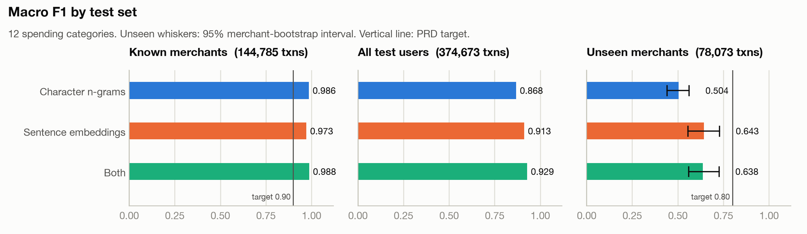
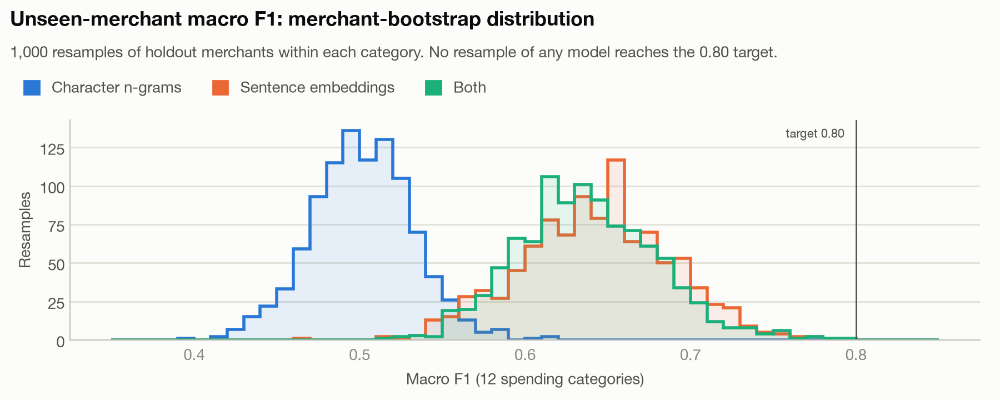
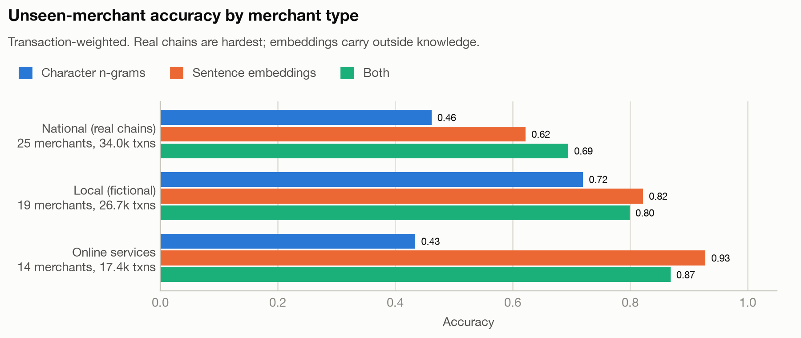
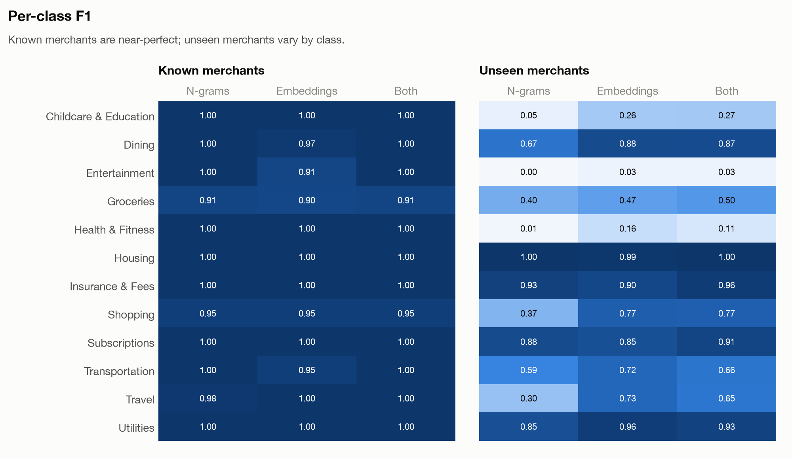
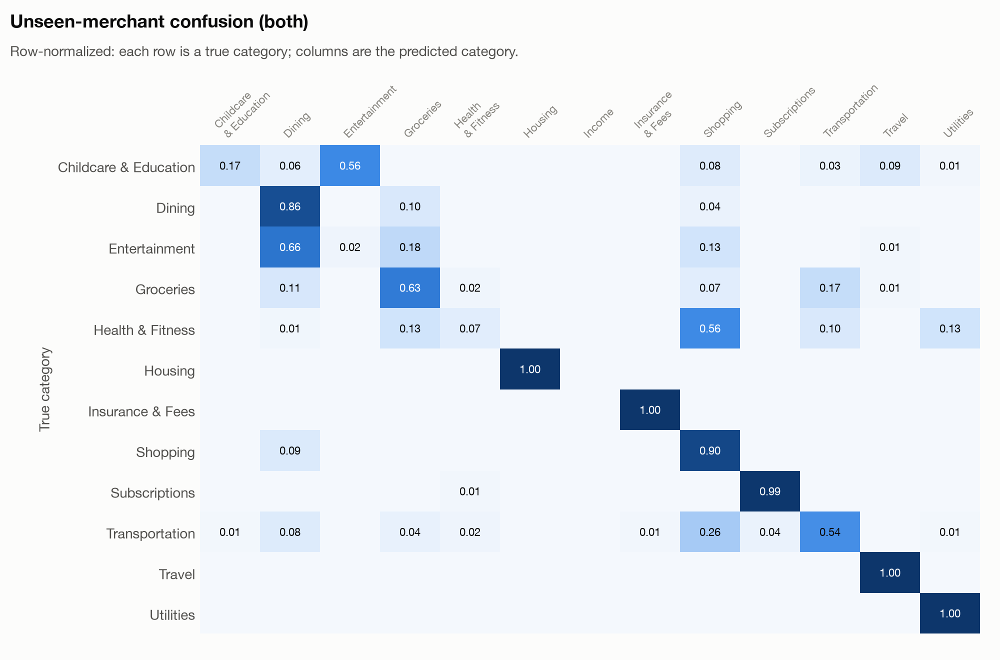
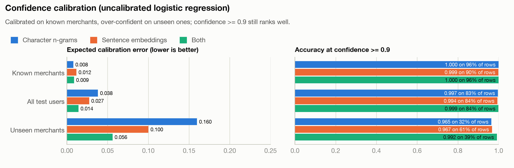
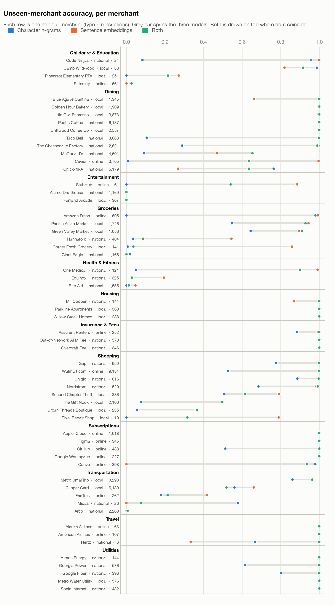
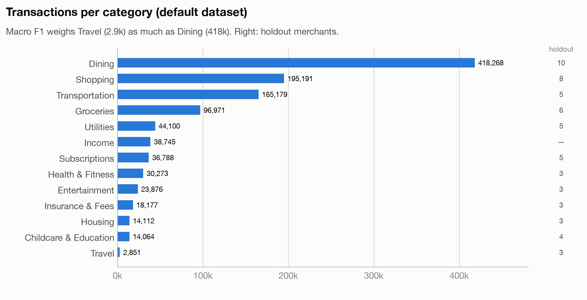

# FR-3 categorization proof of concept

Evidence for the numbers in *FR-3 Transaction Categorization — Feature Design*. This is throwaway experiment code: it reads truth tables directly and is not part of the product package.

## Reproduce

```sh
uv run sfc-data generate --spec configs/data/default.yaml --out data/synthetic/default.sqlite
uv run experiments/fr3_categorization/feasibility.py data/synthetic/default.sqlite
uv run experiments/fr3_categorization/plots.py      # charts, HTML report, screenshot; no retraining
```

Both scripts declare their own dependencies (PEP 723), including `fastembed`, so the project's lock file is unchanged. The first run downloads the embedding model (about 130 MB). A full run takes about 2.5 minutes on a laptop CPU.

## What it does

- **Splits** (Technical Design): known merchants are a stratified 20% of train users' transactions. Unseen merchants are test users' transactions at holdout merchants. "All test users" is every test-user transaction.
- **Training:** the other 80% of train users' transactions, at most 20,000 per class, seed 0. No label noise.
- **Regularization:** C = 10 for n-grams and 3 for the embedding variants, fixed by hand before the first run and never tuned. The report includes a sensitivity table at C = 1, 3 and 10, which was not used to choose C. Unseen-merchant F1 moves by at most 0.03, and no setting changes a conclusion.
- **Models:** multinomial logistic regression with balanced class weights over three feature sets: character 2–4-grams of `merchant_raw`, a frozen `bge-small-en-v1.5` embedding of the normalized text, or both. Each also gets amount bin, sign, channel and hour.
- **Metrics:** macro F1 over exactly the 12 spending categories (Income excluded; see the correction below), per-class F1, the largest error groups, and a 95% interval for unseen merchants from 1,000 bootstrap resamples of merchants within each category.

## Results

| File | What it is |
| --- | --- |
| [results/screenshots/report.png](results/screenshots/report.png) | Full-page screenshot of the HTML report: stat tiles, tables and every chart |
| [results/report.html](results/report.html) | The same report; open locally (it loads charts from `figures/`) |
| [results/figures/](results/figures/) | Each chart as a PNG |
| [results/feasibility.md](results/feasibility.md) | Text report with every table |
| [results/feasibility.json](results/feasibility.json) | Everything: per-class precision and recall, confusion matrices, per-merchant accuracy, bootstrap samples |

A second run gives identical metrics.

**Correction (PR #4 review).** Earlier results understated the embeddings-only row: 0.842 → **0.913** on all test users and 0.593 → **0.643** on unseen merchants. `f1_score` without `labels=` averages over every label in the truth or the predictions. One spending row predicted as Income therefore added Income, with F1 0, to the average. The fix passes the 12 spending labels explicitly; no other row changed.

### Headline: FR-3's target is met; FR-4's is not



### The unseen-merchant gap is not sampling noise

No bootstrap resample of any model reaches 0.80; the best is 0.793.



### Real chains are hardest; embeddings carry outside knowledge







### Confidence is calibrated on known merchants, over-confident on unseen ones

The model is uncalibrated here. Calibration error is 0.008–0.012 on known merchants and 0.056–0.160 on unseen ones. Even so, confidence ≥ 0.9 is at least 96.5% accurate on unseen merchants.



### Per merchant



### Dataset



Charts use the dataviz reference palette; the three series colours were checked with its colour-vision validator (all pairs pass).

## Not done here

No hyperparameter search or confidence calibration (calibration is measured, not fitted), no keyword baseline, and no gradient-boosted tree or transformer candidates. Those belong to the FR-3 milestones.
